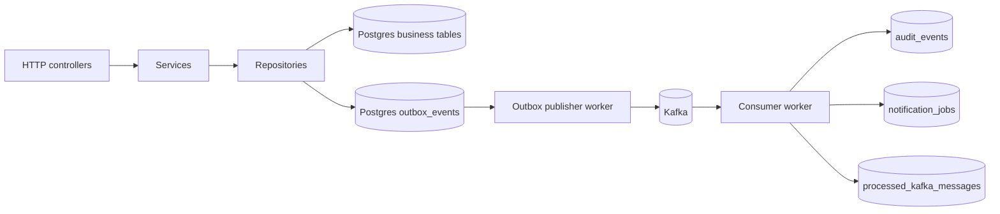

# Kafka Integration Plan

This folder describes a phased Kafka implementation for this NestJS URL shortener.

The goal is to learn both sides of Kafka in a codebase that is still easy to reason about:

- the HTTP application produces domain events when a user is created or a short URL is created
- a publisher worker moves those events from Postgres into Kafka
- a consumer worker reads Kafka messages and builds Postgres projections for audits and notifications

The design intentionally keeps Kafka adjacent to the main business flow instead of making redirect logic depend on it.

## Canonical learning scenario

Use one scenario across all phases so the implementation stays coherent:

1. `POST /users` inserts a user record.
2. The same database transaction inserts an `outbox_events` row with type `user.created`.
3. A publisher worker reads unpublished outbox rows and sends them to Kafka topic `user-events.v1`.
4. A consumer worker reads the Kafka message.
5. The consumer writes to `audit_events`, `notification_jobs`, and `processed_kafka_messages`.
6. `POST /url` repeats the same pattern for `url.created` on topic `url-events.v1`.

## Read order

| Phase | Document | Outcome |
| --- | --- | --- |
| 1 | [phase-1-architecture.md](./phase-1-architecture.md) | Event model, topic design, module boundaries |
| 2 | [phase-2-infrastructure.md](./phase-2-infrastructure.md) | Kafka broker, env vars, local startup flow |
| 3 | [phase-3-producer-and-outbox.md](./phase-3-producer-and-outbox.md) | Producer implementation and reliable publish path |
| 4 | [phase-4-consumer-and-read-model.md](./phase-4-consumer-and-read-model.md) | Consumer implementation, projections, idempotency |
| 5 | [phase-5-testing-and-operations.md](./phase-5-testing-and-operations.md) | Validation, troubleshooting, recovery drills |

## Current code anchors

These are the current files that own the write paths and app composition:

- [src/app.module.ts](../src/app.module.ts)
- [src/user/user.service.ts](../src/user/user.service.ts)
- [src/user/user.repository.ts](../src/user/user.repository.ts)
- [src/url/url.service.ts](../src/url/url.service.ts)
- [src/url/url.repository.ts](../src/url/url.repository.ts)
- [src/auth/auth.service.ts](../src/auth/auth.service.ts)
- [src/db/schema.ts](../src/db/schema.ts)
- [docker-compose.yaml](../docker-compose.yaml)
- [package.json](../package.json)

## Proposed high-level architecture

## Glossary

| Term | Meaning in this repository |
| --- | --- |
| Topic | Kafka stream that groups related events, for example `user-events.v1` |
| Partition | Ordered log segment inside a topic. Start with one partition locally. |
| Consumer group | Logical reader identity. All consumer instances in the same group share work. |
| Offset | Kafka position for one message in one partition. |
| Outbox | Postgres table that stores events before a publisher sends them to Kafka. |
| Projection | Read model derived by the consumer, such as an audit or notification table. |
| Idempotency | Safe repeated processing of the same Kafka message without duplicate side effects. |

## Scope

Included in this documentation set:

- Kafka producer path
- Kafka consumer path
- Postgres outbox pattern
- Idempotent consumer writes
- Local Docker-based Kafka environment
- Operational checks for local development

Explicitly out of scope for the first implementation:

- schema registry
- Avro or Protobuf
- stream processing frameworks
- multi-broker production deployment
- cross-service saga orchestration
- distributed tracing
