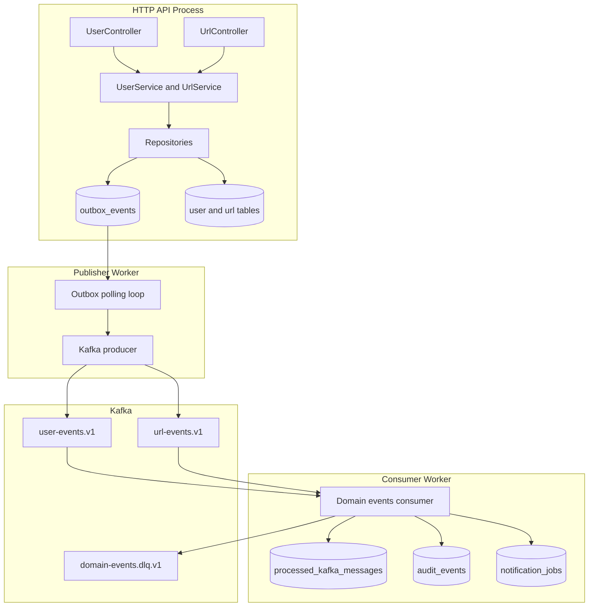
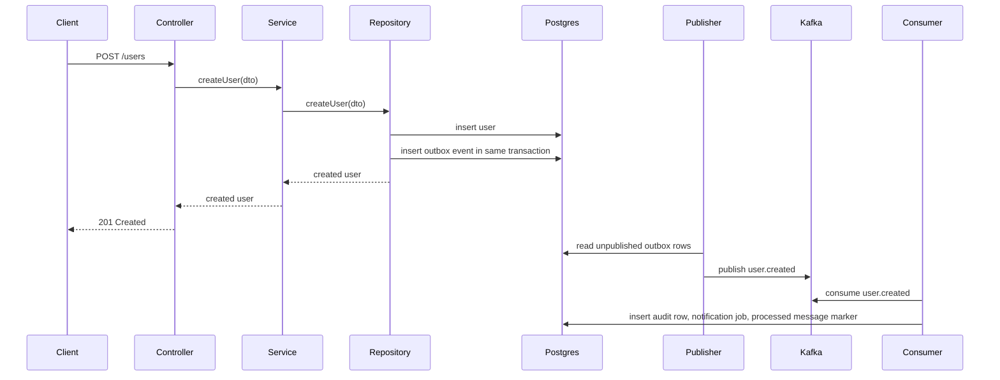

# Phase 1: Architecture

This phase defines the target architecture before any code is added.

## Objective

Introduce Kafka without making the existing request and response flow harder to debug.

The current application is synchronous:

- [src/user/user.controller.ts](../src/user/user.controller.ts) writes users through [src/user/user.service.ts](../src/user/user.service.ts) and [src/user/user.repository.ts](../src/user/user.repository.ts)
- [src/url/url.controller.ts](../src/url/url.controller.ts) writes short URLs through [src/url/url.service.ts](../src/url/url.service.ts) and [src/url/url.repository.ts](../src/url/url.repository.ts)
- [src/app.module.ts](../src/app.module.ts) wires modules directly and has no asynchronous event infrastructure

Kafka should be introduced next to those write paths, not inside the redirect or authentication control flow.

## Why these write paths are the producer anchors

The best producer anchors are the points where a database write has already succeeded:

- `createUser` in [src/user/user.repository.ts](../src/user/user.repository.ts)
- `saveUrl` in [src/url/url.repository.ts](../src/url/url.repository.ts)

Those methods already own the persistence boundary. That makes them the correct place to create domain events because:

- the event payload can include the definitive database identifier
- the event can be inserted into an outbox inside the same transaction as the business row
- producer logic stays close to the state change it describes

Do not publish directly from controllers. Controllers should remain transport adapters.

## Proposed module layout

Add the following modules and processes.

### HTTP application process

This remains the current Nest application started by [src/main.ts](../src/main.ts).

Add these files:

- `src/kafka/kafka.module.ts`
- `src/kafka/kafka.config.ts`
- `src/kafka/event-envelope.ts`
- `src/kafka/outbox.repository.ts`

Modify these files:

- [src/app.module.ts](../src/app.module.ts)
- [src/user/user.repository.ts](../src/user/user.repository.ts)
- [src/url/url.repository.ts](../src/url/url.repository.ts)
- [src/db/schema.ts](../src/db/schema.ts)

### Publisher worker process

This is a separate Nest application context that reads unpublished outbox rows and sends them to Kafka.

Add these files:

- `src/kafka-publisher/main.ts`
- `src/kafka-publisher/kafka-publisher.module.ts`
- `src/kafka-publisher/outbox-publisher.service.ts`

This separation keeps API latency independent from Kafka availability.

### Consumer worker process

This is another Nest application context that subscribes to Kafka topics and writes derived tables.

Add these files:

- `src/kafka-consumer/main.ts`
- `src/kafka-consumer/kafka-consumer.module.ts`
- `src/kafka-consumer/domain-events.consumer.ts`
- `src/kafka-consumer/projections.repository.ts`

## Topic design

Start with a small topic set.

| Topic | Purpose | Key |
| --- | --- | --- |
| `user-events.v1` | User lifecycle events | `user.id` |
| `url-events.v1` | Short URL lifecycle events | `url.hash` |
| `domain-events.dlq.v1` | Poison messages that cannot be processed safely | same as original message key |

Use versioned topic names from the beginning. That makes future contract changes explicit.

## Event contract

All emitted events should use one envelope shape.

```json
{
  "eventId": "5e4a2f0c-7e98-4f95-9da4-4c0f5fb5876b",
  "eventType": "user.created",
  "schemaVersion": 1,
  "aggregateType": "user",
  "aggregateId": "5f9116f7-ec7e-4032-a1b7-21eeb4abef2a",
  "occurredAt": "2026-06-04T12:00:00.000Z",
  "producer": "url-shortener-api",
  "payload": {
    "id": "5f9116f7-ec7e-4032-a1b7-21eeb4abef2a",
    "email": "user@example.com",
    "name": "Alice"
  }
}
```

Required envelope fields:

- `eventId`: immutable unique identifier used for idempotency
- `eventType`: semantic event name such as `user.created` or `url.created`
- `schemaVersion`: integer contract version
- `aggregateType`: `user` or `url`
- `aggregateId`: entity identifier used by consumers
- `occurredAt`: UTC timestamp from the producer side
- `producer`: stable producer identity
- `payload`: event-specific data

## Database additions

Add new tables alongside the current schema in [src/db/schema.ts](../src/db/schema.ts).

| Table | Role |
| --- | --- |
| `outbox_events` | Durable queue between application writes and Kafka publishing |
| `processed_kafka_messages` | Idempotency guard for the consumer |
| `audit_events` | Queryable audit trail for all consumed events |
| `notification_jobs` | Example consumer side effect that is easy to inspect in Postgres |

These tables are described in detail in later phases.

## End-to-end architecture



## Request-to-event sequence



## Design decisions

1. Use the outbox pattern instead of direct publish from the HTTP request path. It prevents the database and Kafka from diverging when one succeeds and the other fails.
2. Keep the publisher and consumer in separate processes. That makes failure modes easier to observe when learning Kafka.
3. Use Postgres projections instead of email or external side effects first. They are faster to verify and easier to reset locally.
4. Keep `auth.login` events as an optional later extension. The first implementation should stay centered on the already existing `user` and `url` write paths.
