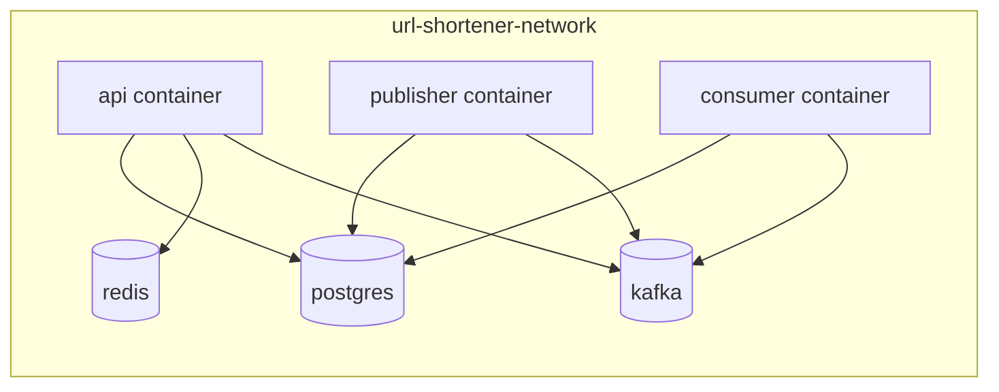

# Phase 2: Infrastructure

This phase defines the runtime pieces required to boot Kafka locally and connect the Nest application to it.

## Objective

Add Kafka to the current Docker-based development environment in a way that keeps local setup predictable.

Current local dependencies already exist in [docker-compose.yaml](../docker-compose.yaml):

- `postgres`
- `redis`
- `api`

Kafka should be added as another local dependency, not mixed into the existing API container image.

## Dependency changes

Add this package to [package.json](../package.json):

```json
{
  "dependencies": {
    "kafkajs": "^2.2.4"
  }
}
```

Recommended script additions:

```json
{
  "scripts": {
    "start:publisher": "tsx src/kafka-publisher/main.ts",
    "start:consumer": "tsx src/kafka-consumer/main.ts",
    "kafka:topics": "tsx src/scripts/create-kafka-topics.ts"
  }
}
```

## Environment variables

Add these variables to `.env`.

```dotenv
KAFKA_CLIENT_ID=url-shortener-api
KAFKA_BROKERS=kafka:9092
KAFKA_TOPIC_USER_EVENTS=user-events.v1
KAFKA_TOPIC_URL_EVENTS=url-events.v1
KAFKA_TOPIC_DLT=domain-events.dlq.v1
KAFKA_CONSUMER_GROUP=url-shortener-projections
KAFKA_PUBLISH_BATCH_SIZE=50
KAFKA_PUBLISH_INTERVAL_MS=2000
```

Notes:

- Keep broker addresses internal to Docker as `kafka:9092` when the API and workers run inside containers.
- If a Node process runs directly on macOS instead of inside Docker, use `localhost:9092`.
- Start with a single broker and single partition per topic for local learning.

## Docker Compose additions

Use Kafka in KRaft mode so local setup does not need ZooKeeper.

Add this service to [docker-compose.yaml](../docker-compose.yaml):

```yaml
  kafka:
    image: bitnami/kafka:3.8
    restart: always
    container_name: url-shortener-kafka
    ports:
      - 9092:9092
    environment:
      KAFKA_CFG_NODE_ID: 1
      KAFKA_CFG_PROCESS_ROLES: broker,controller
      KAFKA_CFG_CONTROLLER_QUORUM_VOTERS: 1@kafka:9093
      KAFKA_CFG_LISTENERS: PLAINTEXT://:9092,CONTROLLER://:9093
      KAFKA_CFG_ADVERTISED_LISTENERS: PLAINTEXT://kafka:9092
      KAFKA_CFG_LISTENER_SECURITY_PROTOCOL_MAP: PLAINTEXT:PLAINTEXT,CONTROLLER:PLAINTEXT
      KAFKA_CFG_CONTROLLER_LISTENER_NAMES: CONTROLLER
      KAFKA_CFG_AUTO_CREATE_TOPICS_ENABLE: 'false'
      KAFKA_KRAFT_CLUSTER_ID: MkU3OEVBNTcwNTJENDM2Qk
      ALLOW_PLAINTEXT_LISTENER: 'yes'
    healthcheck:
      test: ["CMD-SHELL", "kafka-topics.sh --bootstrap-server localhost:9092 --list >/dev/null 2>&1"]
      interval: 10s
      timeout: 5s
      retries: 10
    networks:
      - url-shortener-network
```

Then update `depends_on` for the `api` service so Kafka is available before the API starts when you choose to run everything in containers.

Recommended worker services for later phases:

```yaml
  publisher:
    build:
      context: .
    command: npm run start:publisher
    env_file:
      - ./.env
    depends_on:
      postgres:
        condition: service_healthy
      kafka:
        condition: service_healthy
    networks:
      - url-shortener-network

  consumer:
    build:
      context: .
    command: npm run start:consumer
    env_file:
      - ./.env
    depends_on:
      postgres:
        condition: service_healthy
      kafka:
        condition: service_healthy
    networks:
      - url-shortener-network
```

## Topic bootstrap

Do not rely on broker auto-creation. Create topics explicitly.

Create `src/scripts/create-kafka-topics.ts` with logic that ensures these topics exist:

- `user-events.v1`
- `url-events.v1`
- `domain-events.dlq.v1`

Recommended topic settings for local development:

| Topic | Partitions | Replication factor |
| --- | --- | --- |
| `user-events.v1` | 1 | 1 |
| `url-events.v1` | 1 | 1 |
| `domain-events.dlq.v1` | 1 | 1 |

## Kafka client configuration

Centralize Kafka client creation in `src/kafka/kafka.config.ts`.

Implementation requirements:

1. Parse `KAFKA_BROKERS` into an array.
2. Fail fast if `KAFKA_BROKERS` is empty.
3. Expose a single `clientId` value through configuration.
4. Keep producer and consumer config in one place so the workers share the same defaults.

Example shape:

```ts
export type KafkaSettings = {
  clientId: string;
  brokers: string[];
  userTopic: string;
  urlTopic: string;
  dltTopic: string;
  consumerGroup: string;
  publishBatchSize: number;
  publishIntervalMs: number;
};
```

## Service topology



## Local startup order

Use this order after the implementation is in place:

1. `docker compose up -d postgres redis kafka`
2. `npm install`
3. `npm run db:migrate`
4. `npm run kafka:topics`
5. `npm run start:dev`
6. In a second terminal, `npm run start:publisher`
7. In a third terminal, `npm run start:consumer`

If you later containerize all three application processes, the same order can be expressed by `docker compose up`.

## Exit criteria

This phase is complete when:

- Kafka starts locally through Docker Compose
- topics exist before the API begins to publish
- publisher and consumer can read the same Kafka settings
- the repository has one stable place to manage Kafka configuration
