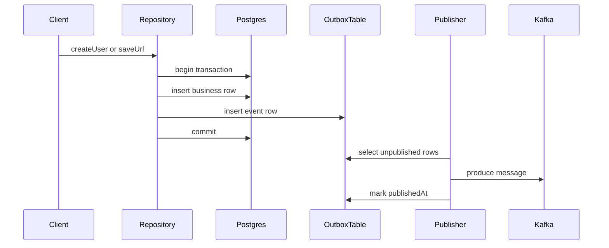

# Phase 3: Producer And Outbox

This phase implements reliable event production from the existing HTTP write flows.

## Objective

Guarantee that when the application persists a business record, it also persists the corresponding event description, even if Kafka is temporarily unavailable.

The implementation should not publish directly from [src/user/user.service.ts](../src/user/user.service.ts) or [src/url/url.service.ts](../src/url/url.service.ts). The reliable boundary is the repository transaction.

## Files to modify and create

Modify:

- [src/app.module.ts](../src/app.module.ts)
- [src/db/schema.ts](../src/db/schema.ts)
- [src/user/user.repository.ts](../src/user/user.repository.ts)
- [src/url/url.repository.ts](../src/url/url.repository.ts)

Create:

- `src/kafka/kafka.module.ts`
- `src/kafka/kafka.config.ts`
- `src/kafka/event-envelope.ts`
- `src/kafka/outbox.repository.ts`
- `src/kafka/outbox-event.factory.ts`
- `src/kafka-publisher/main.ts`
- `src/kafka-publisher/kafka-publisher.module.ts`
- `src/kafka-publisher/outbox-publisher.service.ts`

## New database table

Add `outbox_events` in [src/db/schema.ts](../src/db/schema.ts).

Recommended columns:

| Column | Type | Purpose |
| --- | --- | --- |
| `id` | `uuid` primary key | Unique outbox row identifier |
| `topic` | `varchar` | Kafka topic destination |
| `messageKey` | `varchar` | Kafka partition key |
| `eventType` | `varchar` | Semantic event name |
| `aggregateType` | `varchar` | Domain aggregate kind |
| `aggregateId` | `varchar` | Domain aggregate identifier |
| `payload` | `jsonb` | Serialized event envelope |
| `createdAt` | `timestamp` | Insert time |
| `publishedAt` | `timestamp nullable` | Time successfully published |
| `attempts` | `integer` | Publish attempt counter |
| `lastError` | `varchar nullable` | Last publish failure summary |

Recommended Drizzle shape:

```ts
export const outboxEventsTable = pgTable('outbox_events', {
  id: uuid().primaryKey().defaultRandom(),
  topic: varchar().notNull(),
  messageKey: varchar().notNull(),
  eventType: varchar().notNull(),
  aggregateType: varchar().notNull(),
  aggregateId: varchar().notNull(),
  payload: jsonb().notNull(),
  attempts: integer().notNull().default(0),
  lastError: varchar(),
  createdAt: timestamp().defaultNow().notNull(),
  publishedAt: timestamp(),
});
```

The actual implementation can adjust Drizzle helpers to match the exact version in this repository.

## Event factory

Centralize envelope creation in `src/kafka/outbox-event.factory.ts`.

Required factory methods:

- `buildUserCreatedEvent(user)`
- `buildUrlCreatedEvent(url)`

Each method should return one object that already contains:

- target topic
- message key
- envelope payload
- aggregate metadata

Example mapping:

| Event | Topic | Key | Aggregate ID |
| --- | --- | --- | --- |
| `user.created` | `user-events.v1` | `user.id` | `user.id` |
| `url.created` | `url-events.v1` | `url.hash` | `url.hash` |

## Repository transaction pattern

Both existing repositories should use one transaction per write.

### User flow

Update [src/user/user.repository.ts](../src/user/user.repository.ts) so `createUser` does this:

1. Begin database transaction.
2. Insert into `user`.
3. Build a `user.created` envelope from the inserted row.
4. Insert an outbox row into `outbox_events`.
5. Commit transaction.
6. Return the created user.

### URL flow

Update [src/url/url.repository.ts](../src/url/url.repository.ts) so `saveUrl` does this:

1. Begin database transaction.
2. Insert into `url`.
3. Build a `url.created` envelope from the inserted row.
4. Insert an outbox row into `outbox_events`.
5. Commit transaction.
6. Return the created URL.

The repository should not instantiate Kafka producers. The repository only writes business data and outbox data.

## Publisher worker behavior

`src/kafka-publisher/outbox-publisher.service.ts` is responsible for sending rows from `outbox_events` to Kafka.

Implementation loop:

1. Poll unpublished rows where `publishedAt IS NULL`.
2. Read rows ordered by `createdAt ASC`.
3. Limit batch size by `KAFKA_PUBLISH_BATCH_SIZE`.
4. Send the serialized `payload` to the row's `topic` with `messageKey`.
5. On success, set `publishedAt = now()`.
6. On failure, increment `attempts` and store `lastError`.
7. Sleep for `KAFKA_PUBLISH_INTERVAL_MS`.

The publisher should not delete outbox rows immediately. Keeping published rows for a short time simplifies debugging and replays.

## Sequence of a successful write



## Failure semantics

| Failure point | Expected outcome |
| --- | --- |
| Business insert fails | Transaction rolls back, no outbox row exists |
| Outbox insert fails | Transaction rolls back, no business row persists |
| Kafka publish fails | Business row stays committed, outbox row stays unpublished for retry |
| Publisher process stops | Pending rows remain in `outbox_events` until restart |

## Important implementation rules

1. Do not publish directly during the request handling path.
2. Do not mark an outbox row as published before Kafka confirms success.
3. Do not make the outbox publisher depend on controller or service classes.
4. Log `eventId`, `outbox id`, `topic`, and `aggregateId` on every publish attempt.

## Exit criteria

This phase is complete when:

- `POST /users` creates a user row and an outbox row in one transaction
- `POST /url` creates a URL row and an outbox row in one transaction
- the publisher worker sends outbox rows to Kafka and marks them as published
- broker downtime results in retryable unpublished rows instead of lost events
