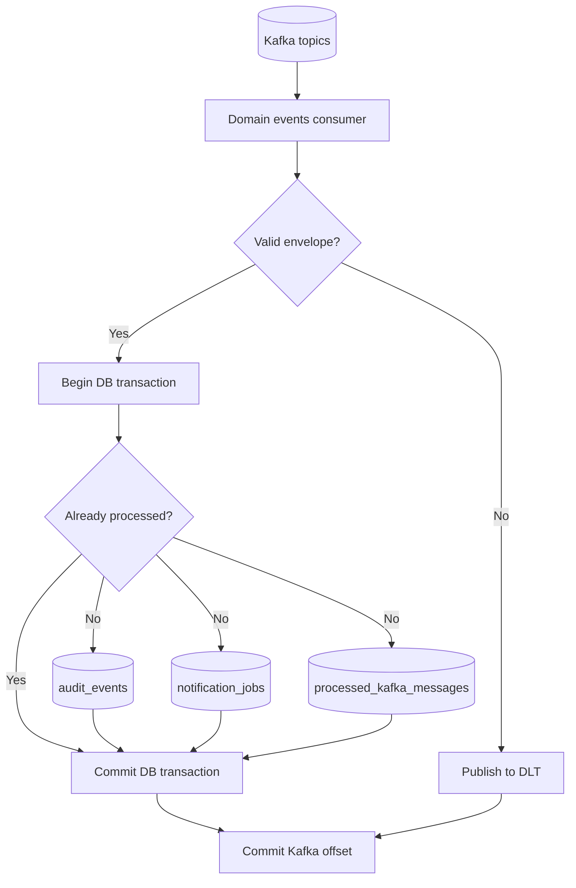
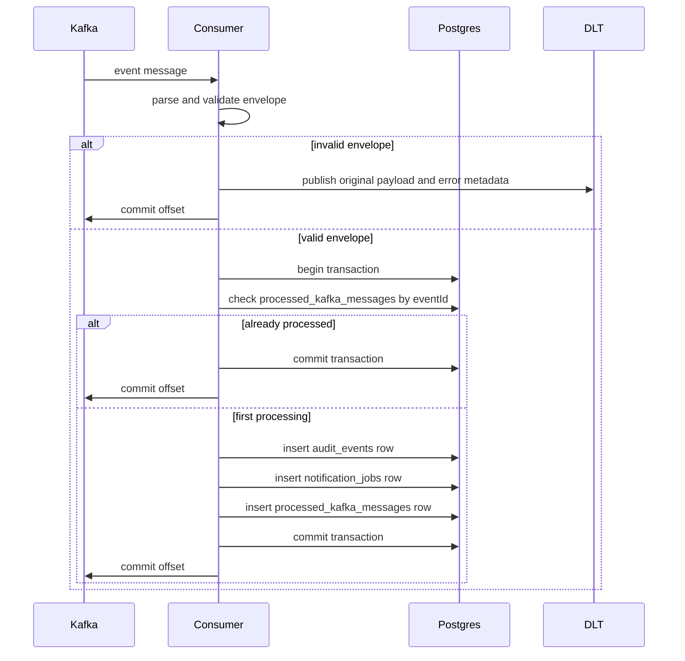

# Phase 4: Consumer And Read Model

This phase implements Kafka consumption and derives queryable state in Postgres.

## Objective

Consume Kafka events safely, make processing idempotent, and materialize results into tables that are easy to inspect during development.

## Files to modify and create

Modify:

- [src/db/schema.ts](../src/db/schema.ts)

Create:

- `src/kafka-consumer/main.ts`
- `src/kafka-consumer/kafka-consumer.module.ts`
- `src/kafka-consumer/domain-events.consumer.ts`
- `src/kafka-consumer/projections.repository.ts`
- `src/kafka-consumer/event-router.ts`
- `src/kafka-consumer/dlt.producer.ts`

## New database tables

Add the following tables in [src/db/schema.ts](../src/db/schema.ts).

### `processed_kafka_messages`

Used to prevent duplicate processing.

Recommended columns:

| Column | Type | Purpose |
| --- | --- | --- |
| `eventId` | `uuid` primary key | Unique event identifier from the envelope |
| `topic` | `varchar` | Source topic |
| `partition` | `integer` | Source partition |
| `offset` | `varchar` | Source offset |
| `processedAt` | `timestamp` | Completion time |

### `audit_events`

Stores one audit row per processed event.

Recommended columns:

| Column | Type | Purpose |
| --- | --- | --- |
| `id` | `uuid` primary key | Internal audit row id |
| `eventId` | `uuid unique` | Link to the Kafka event |
| `eventType` | `varchar` | Event name |
| `aggregateType` | `varchar` | Domain aggregate type |
| `aggregateId` | `varchar` | Domain aggregate id |
| `payload` | `jsonb` | Full event payload |
| `createdAt` | `timestamp` | Audit row creation time |

### `notification_jobs`

Acts as a visible consumer side effect.

Recommended columns:

| Column | Type | Purpose |
| --- | --- | --- |
| `id` | `uuid` primary key | Internal job id |
| `eventId` | `uuid unique` | Event that caused the job |
| `jobType` | `varchar` | For example `welcome-email` or `url-created-summary` |
| `status` | `varchar` | Start with `pending`, `sent`, `failed` |
| `payload` | `jsonb` | Data needed to execute the job later |
| `createdAt` | `timestamp` | Job creation time |

## Consumer process shape

Run the consumer as a standalone Nest application context.

`src/kafka-consumer/main.ts` should:

1. create the Nest application context
2. resolve the consumer service
3. start Kafka subscription logic
4. close gracefully on shutdown signals

This process should subscribe to:

- `user-events.v1`
- `url-events.v1`

Use one consumer group id, for example `url-shortener-projections`.

## Processing algorithm

For each Kafka message:

1. Parse the JSON envelope.
2. Begin a Postgres transaction.
3. Check whether `processed_kafka_messages.eventId` already exists.
4. If it exists, skip side effects and commit.
5. If it does not exist:
6. Insert one `audit_events` row.
7. Insert one `notification_jobs` row.
8. Insert one `processed_kafka_messages` row.
9. Commit transaction.
10. Commit the Kafka offset only after the database transaction succeeds.

This makes the consumer idempotent at the application level.

## Event routing

Create `src/kafka-consumer/event-router.ts` to map event types to handlers.

Recommended first handlers:

| Event type | Consumer action |
| --- | --- |
| `user.created` | Create audit row and a `welcome-email` notification job |
| `url.created` | Create audit row and a `url-created-summary` notification job |

Keep event routing explicit. Avoid one generic handler that hides event-specific behavior.

## Poison message strategy

If a message cannot be parsed or does not match the expected schema:

1. publish the original message to `domain-events.dlq.v1`
2. log the parsing or validation failure
3. commit the original offset so the consumer does not block permanently

If a transient database error occurs:

1. do not commit the Kafka offset
2. allow Kafka to redeliver
3. let idempotency protect against repeated side effects after recovery

## Consumer architecture

## Processing sequence

## Important implementation rules

1. The consumer must treat Kafka delivery as at least once.
2. The database transaction must include both projection writes and the processed message marker.
3. Offset commit must happen after the transaction commits.
4. Consumer logs must include `eventId`, `topic`, `partition`, `offset`, and handler name.

## Exit criteria

This phase is complete when:

- `user.created` produces one audit row and one notification job
- `url.created` produces one audit row and one notification job
- replaying the same event does not create duplicate rows
- malformed messages are redirected to the DLT without blocking the consumer
