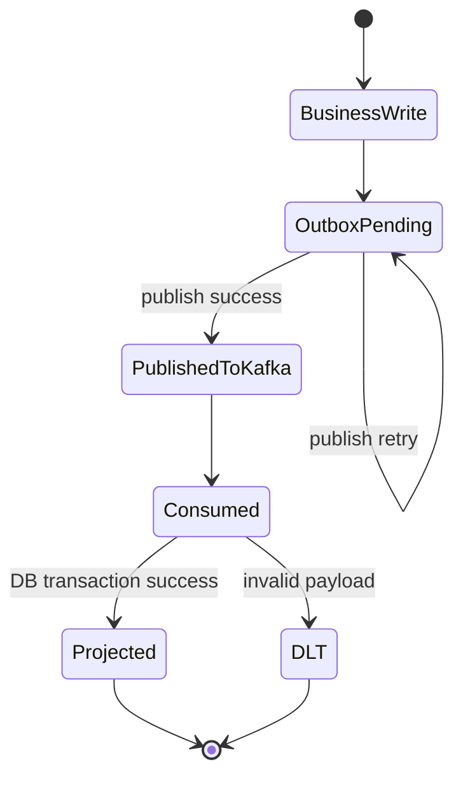

# Phase 5: Testing And Operations

This phase explains how to verify the implementation and how to reason about failures.

## Objective

Prove that the producer, publisher, consumer, and Postgres projections all work together and remain recoverable when one component fails.

## Smoke test matrix

Use these scenarios after phases 2 through 4 are implemented.

| Scenario | Input | Expected result |
| --- | --- | --- |
| User creation | `POST /users` | user row, outbox row, Kafka message, audit row, notification job |
| URL creation | `POST /url` | url row, outbox row, Kafka message, audit row, notification job |
| Duplicate delivery | replay same Kafka event | no duplicate audit row or notification job |
| Publisher outage | stop publisher then create data | outbox row remains unpublished until publisher restarts |
| Consumer outage | stop consumer then create data | message stays in Kafka and is processed after consumer restarts |
| Broker outage | stop Kafka then create data | business row persists, outbox row retries later |

## Recommended local runbook

1. Start infrastructure: `docker compose up -d postgres redis kafka`
2. Apply schema changes: `npm run db:migrate`
3. Create topics: `npm run kafka:topics`
4. Start the API: `npm run start:dev`
5. Start the publisher: `npm run start:publisher`
6. Start the consumer: `npm run start:consumer`
7. Create a user with `POST /users`
8. Create a short URL with `POST /url`
9. Verify database state in the four new tables

## SQL checks

After one successful `POST /users`, the following should be true.

### Business row exists

```sql
select id, email, name
from "user"
order by id desc
limit 1;
```

### Outbox event was created and published

```sql
select id, event_type, topic, aggregate_id, attempts, published_at
from outbox_events
order by created_at desc
limit 5;
```

### Consumer projections were created

```sql
select event_id, event_type, aggregate_type, aggregate_id
from audit_events
order by created_at desc
limit 5;

select event_id, job_type, status
from notification_jobs
order by created_at desc
limit 5;

select event_id, topic, partition, offset
from processed_kafka_messages
order by processed_at desc
limit 5;
```

## Expected log fields

Every stage should log enough identifiers to follow one event end to end.

### API / repository logs

- `eventId`
- `aggregateType`
- `aggregateId`
- `outboxId`

### Publisher logs

- `outboxId`
- `topic`
- `messageKey`
- `attempts`
- `publishedAt`

### Consumer logs

- `eventId`
- `topic`
- `partition`
- `offset`
- `handler`
- `result`

## Failure drills

### Drill 1: Kafka unavailable during publish

1. Stop Kafka.
2. Create a new user.
3. Confirm the `user` row exists.
4. Confirm an `outbox_events` row exists with `published_at` equal to `null`.
5. Restart Kafka.
6. Confirm the publisher retries and fills `published_at`.

Expected lesson: the outbox protects the business transaction from broker downtime.

### Drill 2: Duplicate message delivery

1. Reproduce the same Kafka event manually or restart the consumer before an offset commit.
2. Confirm `processed_kafka_messages` already contains that `eventId`.
3. Confirm no second `audit_events` row is written.
4. Confirm no second `notification_jobs` row is written.

Expected lesson: consumer-side idempotency is mandatory even when the producer is correct.

### Drill 3: Poison message

1. Publish malformed JSON or a message without the required envelope fields.
2. Confirm the consumer logs a validation error.
3. Confirm the message is written to `domain-events.dlq.v1`.
4. Confirm the consumer continues processing later valid messages.

Expected lesson: malformed messages should be isolated, not block the whole consumer group.

## Operational state flow



## What to monitor first

For local development, start with these simple health signals:

- count of unpublished rows in `outbox_events`
- count of failed notification jobs
- consumer lag for `url-shortener-projections`
- size of `domain-events.dlq.v1`

If unpublished rows keep growing while Kafka is healthy, the publisher is the first component to inspect.

## Exit criteria

This phase is complete when:

- each smoke test produces the expected table state
- outage and restart drills end in recovery without manual data repair
- duplicate delivery does not create duplicate projection rows
- malformed messages are isolated through the DLT path
